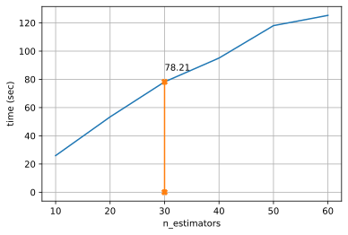
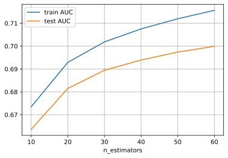

1. Какие признаки имеют пропуски среди своих значений? Что могут означать пропуски в этих признаках (ответьте на этот вопрос для двух любых признаков)?

|№ |Признак |Вероятность пропуска|
| :-- | :-------- | :-------------------- |
|1|first_blood_player2|0.452402|
|2|radiant_flying_courier_time|0.282619|
|3|dire_flying_courier_time|0.268415|
|4|first_blood_player1|0.201100|
|5|first_blood_team|0.201100|
|6|first_blood_time|0.201100|
|7|dire_bottle_time|0.166029|
|8|radiant_bottle_time|0.161380|
|9|radiant_first_ward_time|0.018883|
|10|dire_first_ward_time|0.018780|
|11|radiant_courier_time|0.007117|
|12|dire_courier_time|0.006953|   

Самым не заполненным признаком является first_blood_player2 (ассист первой крови). И в самом деле не в каждой игре первая кровь происходит с поддержкой и не всегда первая кровь (first_blood_player1) приходится на первые пяти минут игры.

В целом про любой не заполненный признак можно сказать, что событие связанное с ним не наступило за первые пять минут игры.
       
2. Как называется столбец, содержащий целевую переменную?
   
**`radiant_win`**
    
3. Как долго проводилась кросс-валидация для градиентного бустинга с 30 деревьями? Инструкцию по измерению времени можно найти выше по тексту. Какое качество при этом получилось?

В моем случае один проход обучения для 30 деревьев занимает около 80 секунд.

4. Имеет ли смысл использовать больше 30 деревьев в градиентном бустинге? Что можно сделать, чтобы ускорить его обучение при увеличении количества деревьев?
       
Небольшой смысл в этом есть, так как мы можем наблюдать хоть и не значительный, но рост качества на валидационной выборке.

Для увеличения скорости можно:

* Уменьшить глубину деревьев
* Обучаться на меньшей подвыборке
* Уменьшить число признаков
* Увеличить learning rate