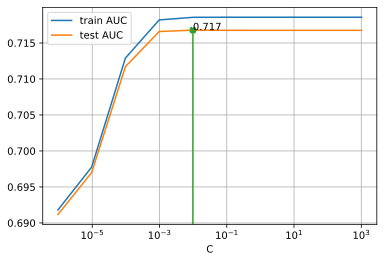

1. Какое качество получилось у логистической регрессии над всеми исходными признаками? Как оно соотносится с качеством градиентного бустинга? Чем вы можете объяснить эту разницу? Быстрее ли работает логистическая регрессия по сравнению с градиентным бустингом?

У логистической регрессии качество получилось выше чем у градиентного бустинга. В нашем случае при линейной регрессии  используется гораздо больше значащих свойств. Если в случае с градиентным бустингом увеличить глубину деревьев или добавить более значимые фичи (например суммарное золото, суммарный опыт), то преимущество будет уже на стороне бустинга.

Логистическая регрессия работает гораздо быстрее градиентного бустинга, так как мы обучаем лишь одну модель.

2. Как влияет на качество логистической регрессии удаление категориальных признаков (укажите новое значение метрики качества)? Чем вы можете объяснить это изменение?
      
Удаление категориальных признаков не сформированных должным образом на качество модели не влияет. Это происходит из-за невозможности линейного разделения необходимых категорий. Мы можем лишь разделить категории на две части с индексом до определенного порога и после.

3. Сколько различных идентификаторов героев существует в данной игре?

В прелагающейся информации указано 113, однако по факту в прилагаемых матчах участвует только 108, у последнего индекс 112.

4. Какое получилось качество при добавлении "мешка слов" по героям? Улучшилось ли оно по сравнению с предыдущим вариантом? Чем вы можете это объяснить?

Качество классификации значительно возрасло, так как выбор персонажей влияет на исход матча.
Когда категории представлены в виде onehot представления или мешка слов их линейное разделение эффективно, так как мы можем линейно разделить все категории.

1. Какое минимальное и максимальное значение прогноза на тестовой выборке получилось у лучшего из алгоритмов?

Все прогнозируемые значения принадлежат отрезку \[0, 1\]
